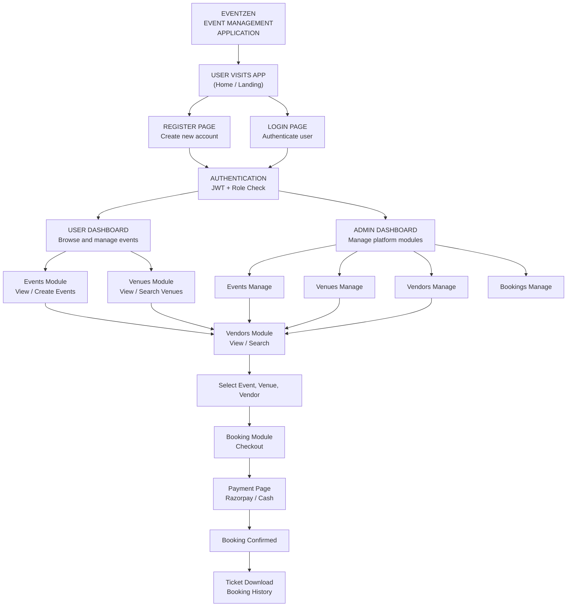
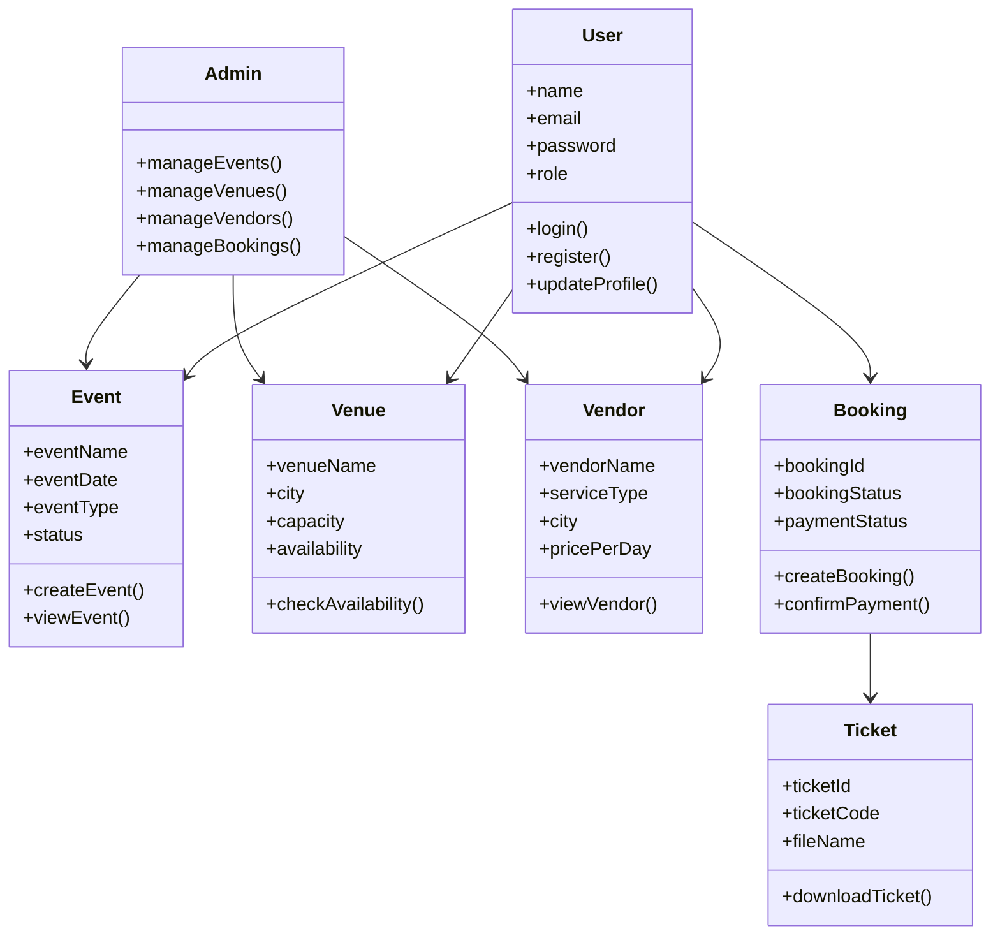
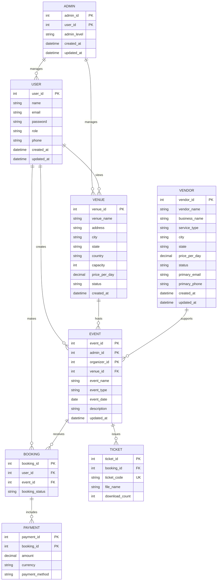

# EventZen

## Docker Setup

### Run The Full Stack

From the repo root:

```bash
docker compose up -d --build
```

### Exposed Services

- Frontend: `http://localhost:5173`
- Auth service: `http://localhost:8081`
- Venue/vendor service: `http://localhost:3001`
- Event service: `http://localhost:3002`
- Booking service: `http://localhost:5050`
- MongoDB: `mongodb://localhost:27017`
- MySQL: `localhost:3307`

### Notes

- The compose file reuses `backend/services/auth-service/public.pem` so JWT validation stays consistent across services.
- The auth service uses the bundled RSA keypair and seeds the default admin user with:

  - email: `admin@eventzen.com`
  - password: `Admin@12345`

- The frontend is built with Vite environment variables at image build time. If you want different public API URLs, update the frontend build args in [docker-compose.yml](./docker-compose.yml).

### Stop The Stack

```bash
docker compose down
```

To also remove volumes:

```bash
docker compose down -v
```

---

EventZen is a full-stack event management platform built as a microservices-based application. It combines a React frontend with separate backend services for authentication, venues and vendors, events, and bookings.

## Application Flow



## UML Diagram Of The Application

The following UML-style diagram gives a high-level view of the main actors and modules in EventZen.



## Entity Relationship Model



## Overview

EventZen supports the main workflows needed for an event platform:

- User registration, login, refresh, logout, and profile management
- Venue discovery and admin venue management
- Vendor discovery and admin vendor management
- Event creation, editing, publishing, and discovery
- Booking checkout, dummy payment confirmation, and downloadable ticket generation
- Role-based access for users and administrators

The repository is organized as a mono-repo with separate frontend and backend folders.

## Repository Structure

```text
.
|-- Frontend/
|   |-- src/
|   |-- public/
|   |-- Dockerfile
|   `-- package.json
|-- Backend/
|   `-- services/
|       |-- auth-service/
|       |-- event-service/
|       |-- booking-service/
|       `-- venue-vendor service/
|-- docker-compose.yml
|-- .env
|-- .env.docker.example
`-- .dockerignore
```

## Architecture

### Frontend

- Stack: React 19, Vite 8, React Router 7, Axios, Tailwind CSS 4
- Responsibilities:
  - Public and authenticated UI
  - Admin panels for venues, vendors, events, bookings, and budgets
  - User dashboards for events, bookings, venues, vendors, and profile
  - Token refresh handling via Axios interceptors

### Backend Services

#### 1. Auth Service

- Location: `Backend/services/auth-service`
- Stack: Spring Boot 3.4, Java 21, Spring Security, Spring Data JPA
- Database: MySQL
- Responsibilities:
  - Registration and login
  - Refresh token cookie flow
  - Password change and reset flows
  - User profile and user management
  - JWT issuance and introspection

#### 2. Venue & Vendor Service

- Location: `Backend/services/venue-vendor service`
- Stack: Node.js 20, Express, Mongoose, Joi, Winston
- Database: MongoDB
- Responsibilities:
  - Venue catalog and venue CRUD
  - Vendor catalog and vendor CRUD
  - Venue availability and vendor lookup flows
  - Search, filtering, and related management APIs

#### 3. Event Service

- Location: `Backend/services/event-service`
- Stack: Node.js 20, Express, Mongoose, Joi, Winston
- Database: MongoDB
- Responsibilities:
  - Event creation, update, deletion, and lookup
  - Admin event listing
  - Optional auth for event discovery
  - Ownership and admin authorization checks

#### 4. Booking Service

- Location: `Backend/services/booking-service`
- Stack: ASP.NET Core, .NET 10, MongoDB Driver, PdfSharp
- Database: MongoDB
- Responsibilities:
  - Checkout session creation
  - Dummy payment confirmation using `RAZORPAY` or `CASH`
  - User and admin booking views
  - PDF ticket generation and download

## Frontend Routes and Experience

The frontend includes both public and protected areas.

### Public routes

- `/`
- `/login`
- `/register`
- `/venues`
- `/venues/:id`

### Authenticated user routes

- `/dashboard`
- `/events/create`
- `/events/discover`
- `/events/my`
- `/events/:id`
- `/events/edit/:id`
- `/bookings/my`
- `/booking/payment`
- `/profile`
- `/user/venues`
- `/user/vendors`
- `/vendors`
- `/vendors/:id`

### Admin routes

- `/admin/venues`
- `/admin/venues/new`
- `/admin/venues/edit/:id`
- `/admin/vendors`
- `/admin/vendors/new`
- `/admin/vendors/edit/:id`
- `/admin/events`
- `/admin/events/new`
- `/admin/events/edit/:id`
- `/admin/events/:id`
- `/admin/bookings`
- `/admin/budgets`

## API Summary

This is a practical summary of the main API groups exposed by the services.

### Auth service

- `POST /api/v1/auth/register`
- `POST /api/v1/auth/login`
- `POST /api/v1/auth/refresh`
- `POST /api/v1/auth/logout`
- `POST /api/v1/auth/change-password`
- `GET /api/v1/auth/me`
- `PUT /api/v1/auth/me`
- `POST /api/v1/auth/introspect`

### Venue & vendor service

- `GET /api/v1/venues`
- `GET /api/v1/venues/:id`
- `POST /api/v1/venues`
- `PUT /api/v1/venues/:id`
- `DELETE /api/v1/venues/:id`
- `GET /api/v1/vendors`
- `GET /api/v1/vendors/:id`
- `POST /api/v1/vendors`
- `PUT /api/v1/vendors/:id`
- `DELETE /api/v1/vendors/:id`

### Event service

- `GET /api/v1/events`
- `GET /api/v1/events/admin/all`
- `GET /api/v1/events/:id`
- `POST /api/v1/events`
- `PUT /api/v1/events/:id`
- `PUT /api/v1/events/:id/status`
- `DELETE /api/v1/events/:id`

### Booking service

- `POST /api/v1/bookings/checkout-session`
- `POST /api/v1/bookings/:bookingId/confirm-payment`
- `GET /api/v1/bookings/my-bookings`
- `GET /api/v1/bookings/admin/bookings`
- `GET /api/v1/bookings/:bookingId/ticket`

## Data Layer

### MySQL

- Used by the auth service
- Default Docker database name: `eventzen_auth`

### MongoDB

- `eventzen_venues` for the venue-vendor service
- `eventzen_events` for the event service
- `eventzen_bookings` for the booking service

The booking service also creates indexes for booking and payment audit lookups during startup.

## Environment Variables

The repository currently uses `.env` for local values and `.env.docker.example` for Docker-friendly defaults.

### Shared frontend-facing variables

- `VITE_API_BASE_URL`
- `VITE_EVENT_SERVICE_URL`
- `VITE_VENUE_VENDOR_SERVICE_URL`
- `VITE_BOOKING_SERVICE_URL`
- `ALLOWED_ORIGINS`

### Auth service variables

- `SERVER_PORT`
- `DB_URL`
- `DB_USERNAME`
- `DB_PASSWORD`
- `DB_DRIVER`
- `APP_SECURITY_COOKIE_SECURE`
- `JWT_PRIVATE_KEY`
- `JWT_PUBLIC_KEY`

### Venue-vendor service variables

- `PORT`
- `NODE_ENV`
- `MONGODB_URI`
- `JWT_SKIP_VERIFICATION`
- `AUTH_SERVICE_URL`
- `EVENT_SERVICE_URL`

### Event service variables

- `PORT`
- `NODE_ENV`
- `MONGODB_URI`
- `JWT_SKIP_VERIFICATION`
- `VENUE_VENDOR_SERVICE_URL`
- `AUTH_SERVICE_URL`

### Booking service variables

- `PORT`
- `ASPNETCORE_URLS`
- `MONGODB_URI`
- `BOOKING_DATABASE_NAME`
- `JWT_SKIP_VERIFICATION`
- `EVENT_SERVICE_URL`
- `AUTH_SERVICE_URL`
- `DUMMY_RAZORPAY_KEY`

## Local Development Without Docker

If you want to run each part separately, use the service-native commands below.

### Prerequisites

- Node.js 20+
- Java 21+
- Maven 3.9+
- .NET SDK 10.0
- MongoDB 7+
- MySQL 8+

### 1. Frontend

```powershell
Set-Location Frontend
npm install
npm run dev
```

### 2. Auth Service

```powershell
Set-Location Backend/services/auth-service
mvn spring-boot:run
```

Default URL: `http://localhost:8081`

Default admin account from the service README:

- Email: `admin@eventzen.com`
- Password: `Admin@12345`

### 3. Venue & Vendor Service

```powershell
Set-Location "Backend/services/venue-vendor service"
npm install
npm run dev
```

Optional seed command:

```powershell
npm run seed
```

Default URL: `http://localhost:3001`

### 4. Event Service

```powershell
Set-Location Backend/services/event-service
npm install
npm run dev
```

Default URL: `http://localhost:3002`

### 5. Booking Service

```powershell
Set-Location Backend/services/booking-service
dotnet restore
dotnet run
```

Default URL: `http://localhost:5050`

## Service-to-Service Communication

EventZen is not a single backend. The services depend on each other:

- The frontend authenticates through the auth service and stores the access token client-side.
- The frontend calls service-specific APIs through separate Axios clients.
- The event service can contact the auth service and venue-vendor service.
- The venue-vendor service can contact the auth service and event service.
- The booking service validates users and events through the auth and event services before creating bookings.

## Authentication and Authorization

- The frontend attaches bearer tokens through Axios interceptors.
- Refresh tokens are handled via the auth service refresh endpoint.
- Protected UI routes use `ProtectedRoute`.
- Admin UI routes are limited to `ADMIN` and `SUPER_ADMIN`.
- Backend services support JWT-based flows, with local Docker setups allowing `JWT_SKIP_VERIFICATION=true` for easier integration.

## Typical User Flow

1. Register or log in through the auth service.
2. Browse venues or vendors and discover available events.
3. Create an event or manage existing events if authorized.
4. Create a checkout session for an event booking.
5. Confirm payment with a dummy payment method.
6. Download the generated PDF ticket.

## Scripts

### Frontend

- `npm run dev`
- `npm run build`
- `npm run lint`
- `npm run preview`

### Event service

- `npm start`
- `npm run dev`
- `npm test`
- `npm run lint`

### Venue & vendor service

- `npm start`
- `npm run dev`
- `npm test`
- `npm run test:watch`
- `npm run test:coverage`
- `npm run lint`
- `npm run lint:fix`
- `npm run seed`

### Booking service

- `dotnet restore`
- `dotnet run`
- `dotnet publish -c Release`

### Auth service

- `mvn spring-boot:run`
- `mvn test`
- `mvn package`

## Testing and Validation

Existing documentation and scripts suggest the following validation paths:

- Venue-vendor service includes Jest-based tests and a dedicated `TEST_CASES.md`
- Booking service includes a dedicated README and MongoDB schema notes
- Auth service exposes health and user/auth endpoints suitable for manual verification
- Docker Compose is the easiest way to validate cross-service integration

## Known Implementation Notes

- The frontend README still contains the default Vite template text and is not the authoritative project overview.
- The booking service currently uses a dummy payment flow rather than a live payment gateway integration.
- The Compose setup is intended for local development and integration testing, not hardened production deployment.
- The booking service targets `.NET 10`, so matching SDK/runtime availability is required for local non-Docker execution.

## Recommended Starting Point

For the smoothest first run:

1. Copy `.env.docker.example` to `.env`
2. Start everything with `docker compose up --build`
3. Open `http://localhost:5173`
4. Test the auth, event, venue/vendor, and booking flows together

## Additional Documentation

- [Frontend/README.md](./Frontend/README.md)
- [Backend/services/booking-service/MONGODB_SCHEMA.md](./Backend/services/booking-service/MONGODB_SCHEMA.md)
- [Backend/services/venue-vendor service/TEST_CASES.md](./Backend/services/venue-vendor%20service/TEST_CASES.md)
